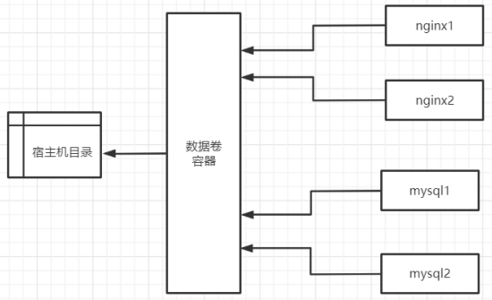

# Docker数据卷

## 什么是数据卷

当我们在使用docker容器的时候，会产生一系列的数据文件，这些数据文件在我们删除docker容器时是会消失的。数据卷存在于一个或多个的容器中，由docker挂载到容器，但不属于联合文件系统，Docker不会在容器删除时删除其挂载的数据卷。
特点：

1. 数据卷可以在容器之间共享或重用数据
2. 数据卷中的更改可以立即生效
3. 数据卷中的更改不会包含在镜像的更新中
4. 数据卷默认会一直存在，即使容器被删除
5. 数据卷的生命周期一直持续到没有容器使用它为止

容器中的管理数据主要有两种方式：

- 数据卷：Data Volumes 容器内数据直接映射到本地主机环境
- 数据卷容器：Data Volume Containers 使用特定容器维护数据卷

## cp命令

当然还有最原始的copy方式，这个也是管理数据的方式，但是基本不会用到。
`docker cp` :用于容器与主机之间的数据拷贝。

### 语法

```bash
宿主机文件复制到容器内 
docker cp [OPTIONS] SRC_PATH CONTAINER:DEST_PATH 

容器内文件复制到宿主机 
docker cp [OPTIONS] CONTAINER:SRC_PATH DEST_PATH
```

### 常用参数

- -L :保持源目标中的链接

### 宿主机文件 copy to 容器内

宿主机的index.html页面覆盖容器内的index.html页面

```bash
docker run -itd --name nginx -p 80:80 nginx:1.19.3-alpine 

cd /data 
echo "laosiji" > /data/index.html 

docker cp /data/index.html nginx:/usr/share/nginx/html/index.html
```

### 容器内文件 copy to 宿主机

将容器内的nginx.cnf复制到宿主机中

```bash
docker run -itd --name nginx -p 80:80 nginx:1.19.3-alpine 

cd /data 
docker cp nginx:/etc/nginx/nginx.conf /data
```

## 数据卷

数据卷(Data Volumes)是一个可供一个或多个容器使用的特殊目录，它将主机操作系统目录直接映射进容器。

### 注意事项

- 挂载数据卷，最好是通过run而非create/start创建启动容器，create/start命令创建启动容器后，再挂载数据卷相当麻烦，要修改很多配置文件，但并非不可以。
- docker官网推荐尽量进行目录挂载，不要进行文件挂载

### 数据卷类型

有三种数据卷类型：

1. 宿主机数据卷：直接在宿主机的文件系统中但是容器可以访问（bind mount） 
2.  命名的数据卷：磁盘上Docker管理的数据卷，但是这个卷有个名字。
3. 匿名数据卷：磁盘上Docker管理的数据卷，因为没有名字想要找到不容易，Docker来管理这些文件。

数据卷其实都在（如果没有网络文件系统等情况下）宿主机文件系统里面的，只是第一种是在宿主机内的特定目录下，而后两种则在docker管理的目录下，这个目录一般是 /var/lib/docker/volumes/

**推荐大家使用** 宿主机数据卷 **方式持久化数据**

### 宿主机数据卷

bind mounts：容器内的数据被存放到宿主机文件系统的任意位置，甚至存放到一些重要的系统目录或文件中。除了docker之外的进程也可以任意对他们进行修改。

当使用bind mounts时，宿主机的目录或文件被挂载到容器中。容器将按照挂载目录或文件的绝对路径来使用或修改宿主机的数据。宿主机中的目录或文件不需要预先存在，在需要的使用会自动创建。

使用bind mounts在性能上是非常好的，但这依赖于宿主机有一个目录妥善结构化的文件系统。

使用bind mounts的容器可以在通过容器内部的进程对主机文件系统进行修改，包括创建，修改和删除重要的系统文件和目录，这个功能虽然很强大，但显然也会造成安全方面的影响，包括影响到宿主机上
Docker以外的进程

#### 数据覆盖问题

- 如果挂载一个空的数据卷到容器中的一个非空目录中，那么这个目录下的文件会被复制到数据卷中如果挂载一个非空的数据卷到容器中的一个目录中，那么容器中的目录会显示数据卷中的数据。

- 如果原来容器中的目录有数据，那么原始数据会被隐藏掉

#### 语法

```bash
docker run -v /宿主机绝对路径目录:/容器内目录 镜像名
```

#### 基础镜像

```bash
docker pull mysql:5.7.31
```

#### 运行镜像

**推荐还是先创建好目录后再进行数据挂载**

```bash
docker run -itd --name mysql --restart always --privileged=true -p 3306:3306 -e MYSQL_ROOT_PASSWORD=admin -v /data/mysql:/var/lib/mysql mysql:5.7.31 -- character-set-server=utf8 --collation-server=utf8_general_ci
```

#### 容器目录权限

```bash
通过 -v 容器内路径： ro rw 改变读写权限 

ro:readonly 只读 
rw:readwrite 可读可写 

docker run -it -v /宿主机绝对路径目录:/容器内目录:ro 镜像名 docker run -it -v /宿主机绝对路径目录:/容器内目录:rw 镜像名

例如： docker run -d -P --name nginx05 -v lagouedu1:/etc/nginx:ro nginx 
docker run -d -P --name nginx05 -v lagouedu2:/etc/nginx:rw nginx 

ro 只要看到ro就说明这个路径只能通过宿主机来操作，容器内部是无法操作！
```

#### 挂载目录权限问题

```
https://hub.docker.com/r/sonatype/nexus3
```

```bash
拉取镜像 
docker pull sonatype/nexus3:3.28.1 

备份镜像 
docker save sonatype/nexus3:3.28.1 -o sonatype.nexus3.3.28.1.tar 

导入镜像 
docker load -i sonatype.nexus3.3.28.1.tar
```

```bash
运行容器 
docker run -d -p 8081:8081 --name nexus3 sonatype/nexus3:3.28.1

进入容器查找初始化密码 
docker exec -it nexus3 /bin/bash 

cd /nexus-data/ 

cat admin.password 

浏览器端访问 
http://192.168.198.100:8081/ 

docker rm $(docker stop $(docker ps -aq))
```

```bash
数据卷挂载 
docker run -d -p 8081:8081 --name nexus3 -v /data/nexus3/:/nexus-data/ sonatype/nexus3:3.28.1 

查看容器启动日志 
docker logs -f nexus3 
报错信息如下： 
mkdir: cannot create directory '../sonatype-work/nexus3/log': Permission denied mkdir: cannot create directory '../sonatype-work/nexus3/tmp': Permission denied OpenJDK 64-Bit Server VM warning: Cannot open file ../sonatype- work/nexus3/log/jvm.log due to No such file or directory Warning: Cannot open log file: ../sonatype-work/nexus3/log/jvm.log Warning: Forcing option -XX:LogFile=/tmp/jvm.log java.io.FileNotFoundException: ../sonatype- work/nexus3/tmp/i4j_ZTDnGON8hezynsMX2ZCYAVDtQog=.lock (No such file or directory) ....
```

```bash
删除容器 
docker rm -f nexus3 

查看官网说明文档，需要为挂载目录授权 
chown -R 200 nexus3/ 

运行容器 
docker run -d -p 8081:8081 --name nexus3 -v /data/nexus3/:/nexus-data/ sonatype/nexus3:3.28.1 

查看容器启动日志 
docker logs -f nexus3
```

总结：开发环境中推荐各位小伙伴为挂载目录授最高权限777；生产环境需要查看官网文档，结合实际
生产环境进行授权。

### 命名的数据卷

#### 挂载数据卷

```bash
docker run -itd --name nginx -p 80:80 -v lagouedu-nginx:/etc/nginx nginx:1.19.3- alpine 

查看docker数据卷 
docker volume ls 

查看lagouedu-nginx宿主机目录 
docker volume inspect lagouedu-nginx 

进入docker数据卷默认目录 
cd /var/lib/docker/volumes/lagouedu-nginx 

查看文件 
ls

所有的文件docker默认保存在_data目录中 
cd _data 

删除容器 
docker rm $(docker stop $(docker ps -aq)) 

查看挂载数据是否还存在，通过查看数据，发现删除容器后，宿主机中的数据还存在 l
s
```

### 匿名数据卷

#### 挂载数据卷

```bash
docker run -itd --name nginx -p 80:80 -v /etc/nginx nginx:1.19.3-alpine 

查看docker数据卷 
docker volume ls 

查看宿主机目录
docker volume inspect dbd07daa4e40148b11.... 

进入docker数据卷默认目录 
cd /var/lib/docker/volumes/dbd07daa4e40148b11.... 

查看文件 
ls

所有的文件docker默认保存在_data目录中 
cd _data 

删除容器 
docker rm $(docker stop $(docker ps -aq)) 

查看挂载数据是否还存在，通过查看数据，发现删除容器后，宿主机中的数据还存在 
ls
```

### 清理数据卷

删除上面创建的容器后会，发现数据卷仍然存在，我们就需要去清理它，不然会占用我们的资源

```bash
docker volume ls 

清理数据卷 docker volume prune 

docker volume ls
```

### 数据卷容器

#### 基础镜像

```bash
docker pull centos:7.8.2003 
docker pull nginx:1.19.3-alpine 
docker pull mysql:5.7.31
```

#### run命令

```bash
docker run
```

- --volumes-from：

如果用户需要在多个容器之间共享一些持续更新的数据，最简单的方式是使用数据卷容器。数据卷容器也是一个容器，但是它的目的是专门用来提供数据卷供其他容器挂载。

发现创建好的数据卷容器是处于停止运行的状态，因为使用 —volumes-from 参数所挂载数据卷的容器自己并不需要保持在运行状态。



```bash
docker run -d --name data-volume -v /data/nginx:/usr/share/nginx/html -v /data/mysql:/var/lib/mysql centos:7.8.2003
```

```bash
docker run -itd --name nginx01 -p 80:80 --volumes-from data-volume nginx:1.19.3- alpine 
echo "lagouedu nginx" > /data/nginx/index.html 
http://192.168.198.100 

docker run -itd --name nginx02 -p 81:80 --volumes-from data-volume nginx:1.19.3- alpine http://192.168.198.100:81
```

```bash
docker run -itd --name mysql01 --restart always --privileged=true -p 3306:3306 -e MYSQL_ROOT_PASSWORD=admin --volumes-from data-volume mysql:5.7.31 -- character-set-server=utf8 --collation-server=utf8_general_ci 

docker run -itd --name mysql02 --restart always --privileged=true -p 3307:3306 -e MYSQL_ROOT_PASSWORD=admin --volumes-from data-volume mysql:5.7.31 -- character-set-server=utf8 --collation-server=utf8_general_ci
```

